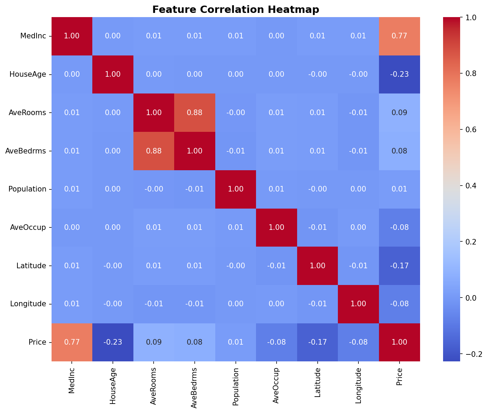
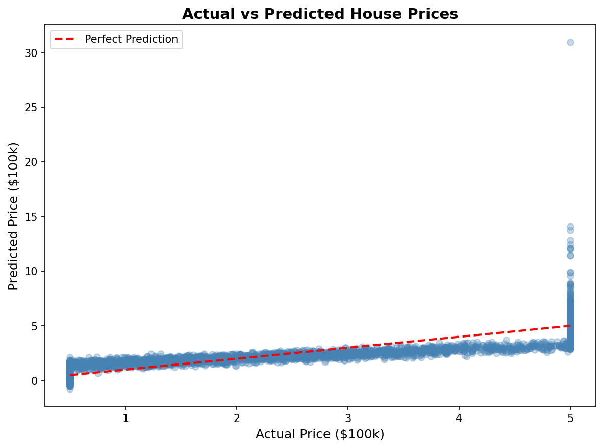

# 🏠 House Price Predictor

A machine learning project that predicts California housing prices using Linear Regression. Built with scikit-learn as an introduction to core ML concepts.

---

## 📋 Project Overview

This model takes neighborhood-level features as input and predicts the median house price for that area. It uses the **California Housing Dataset** which contains data from 20,000+ neighborhoods.

---

## 📊 Dataset Features

| Feature      | Description                                    |
| ------------ | ---------------------------------------------- |
| `MedInc`     | Median household income in the neighborhood    |
| `HouseAge`   | Median age of houses                           |
| `AveRooms`   | Average number of rooms per household          |
| `AveBedrms`  | Average number of bedrooms per household       |
| `Population` | Neighborhood population                        |
| `AveOccup`   | Average number of occupants per household      |
| `Latitude`   | Geographic latitude                            |
| `Longitude`  | Geographic longitude                           |
| **`Price`**  | **Target — median house price (in $100,000s)** |

---

## 🔍 Exploratory Data Analysis

### Feature Correlation Heatmap

The heatmap below shows how strongly each feature correlates with house price and with each other. Values close to **1.0** indicate a strong positive relationship; values close to **-1.0** indicate a strong negative relationship.



**Key insight:** `MedInc` (median income) has the highest positive correlation with price — wealthier neighborhoods command significantly higher house prices.

---

## ⚙️ Model Pipeline

```
Raw Data → Train/Test Split (80/20) → StandardScaler → Linear Regression → Predictions
```

1. **Train/Test Split** — 80% of data used for training, 20% held out for evaluation
2. **StandardScaler** — normalizes all features to mean=0, std=1 so no feature dominates
3. **Linear Regression** — learns a weight for each feature that minimizes prediction error

---

## 📈 Results

### Actual vs Predicted Prices

The scatter plot below compares the model's predictions against real house prices on the test set. The red dashed line represents perfect predictions — the closer the dots are to it, the better.



### Performance Metrics

| Metric       | Value  | Meaning                                |
| ------------ | ------ | -------------------------------------- |
| **MSE**      | 0.5559 | Mean Squared Error                     |
| **RMSE**     | 0.7456 | Off by ~$74,560 on average             |
| **R² Score** | 0.5758 | Model explains ~58% of price variation |

**Interpretation:** The model performs reasonably well for a baseline linear model. The scatter plot shows predictions are generally in the right range but struggle with very high-priced homes — a known limitation of linear regression on non-linear data.

---

## 🛠️ Tech Stack

- **Python 3.12**
- **pandas** — data loading and manipulation
- **scikit-learn** — model training and evaluation
- **matplotlib / seaborn** — data visualization

---

## 🚀 How to Run

```bash
# Install dependencies
pip install numpy pandas scikit-learn matplotlib seaborn

# Run the model
python3 house_prices.py
```

---

## 🧠 Concepts Covered

- Exploratory Data Analysis (EDA)
- Feature correlation analysis
- Train/test splitting
- Feature standardization
- Linear Regression
- Model evaluation with RMSE and R²

---

## 🔮 Next Steps

Linear Regression has a ceiling — it can only model straight-line relationships. Potential improvements:

- **Random Forest Regressor** — handles non-linear relationships, typically boosts R² to ~0.80+
- **Feature engineering** — create new features like income-to-room ratio
- **Hyperparameter tuning** — use GridSearchCV to optimize model parameters
